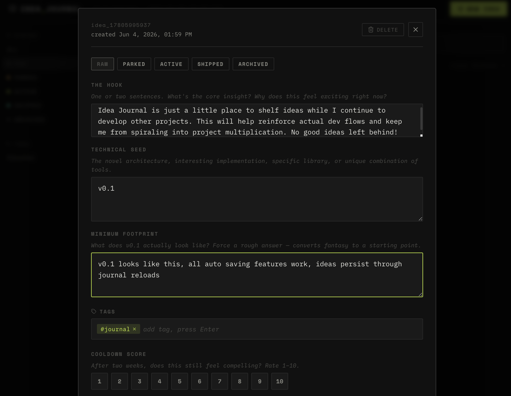

# IDEA JOURNAL

> A structured capture tool for developers who think faster than they ship.



Built for the moment creative brilliance strikes mid-dev-cycle — log it, park it, come back to it. Every idea gets three fields that convert raw inspiration into something actionable, a status lifecycle to track where it lives in your pipeline, and a cooldown score to separate real ideas from temporary excitement.

---

## Why This Exists

The biggest threat to shipping isn't distraction — it's **project multiplication**. A new idea hits at 2am and suddenly you're laying the groundwork for something new instead of pushing the current project to v1.0.

Idea Journal is the parking lot. Capture the idea with enough structure to recover it later, set it to `PARKED`, and get back to work.

---

## Structure

Every idea is captured across three intentional fields:

| Field | Purpose |
|---|---|
| **THE HOOK** | One or two sentences. The core insight. Why it feels exciting *right now*. |
| **TECHNICAL SEED** | The novel architecture, specific library, or unique implementation detail. |
| **MINIMUM FOOTPRINT** | What does v0.1 actually look like? Converts fantasy into a starting point. |

---

## Status Lifecycle

```
RAW → PARKED → ACTIVE → SHIPPED → ARCHIVED
```

- **RAW** — just captured, unreviewed
- **PARKED** — logged and cooling off
- **ACTIVE** — promoted to current dev cycle
- **SHIPPED** — done
- **ARCHIVED** — dead end, kept for reference

---

## Features

- Three-field structured capture (Hook / Technical Seed / Minimum Footprint)
- Status lifecycle with sidebar filtering
- Free-form tags with full-text search
- Cooldown score (1–10) for two-week reviews
- Live autosave to `localStorage` on every keystroke
- Dark terminal aesthetic — IBM Plex Mono + Space Mono

---

## Stack

- Vite + React
- CSS Modules
- FastAPI + Python (backend sidecar)
- JSON file persistence (replaces localStorage)
- lucide-react icons

---

## Getting Started

```bash
git clone git@github.com:hellasleeper108/Idea-Journal.git
cd Idea-Journal
npm install
npm run dev        # frontend on :5173
```

### Backend setup (required for data persistence)

```bash
cd backend
python3 -m venv .venv
source .venv/bin/activate
pip install -r requirements.txt
cd ..
python -m uvicorn backend.main:app --port 8000   # API on :8000
```

Then open `http://localhost:5173`. The frontend proxies `/api/*` to the backend.

---

## Roadmap

| Version | Status | Description |
|---|---|---|
| v0.1 | ✅ shipped | Core journal — capture, status, tags, cooldown score, persistence |
| v1.0 | ✅ shipped | Hermes agent integration — FastAPI sidecar, JSON file backend, full CRUD API |

---

## Part Of

**Silicon Warlock LLC** — [github.com/hellasleeper108](https://github.com/hellasleeper108)
