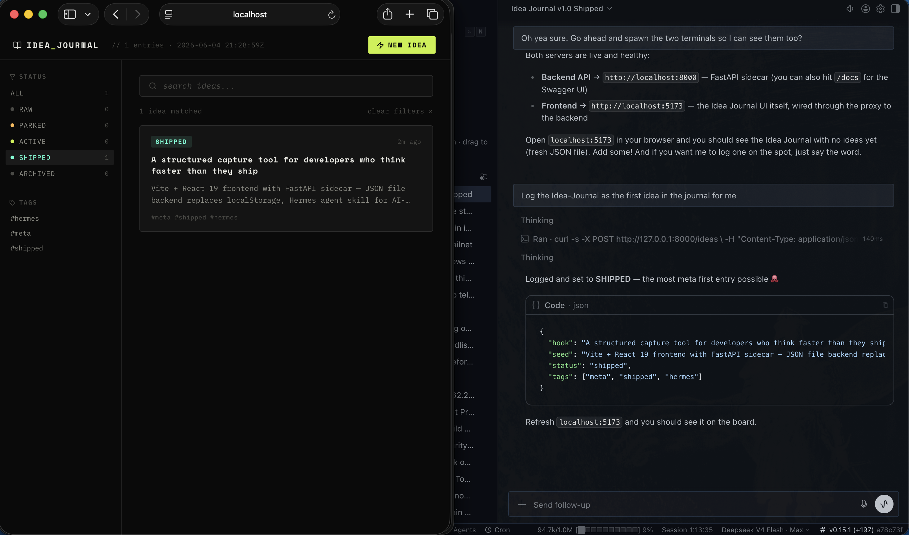
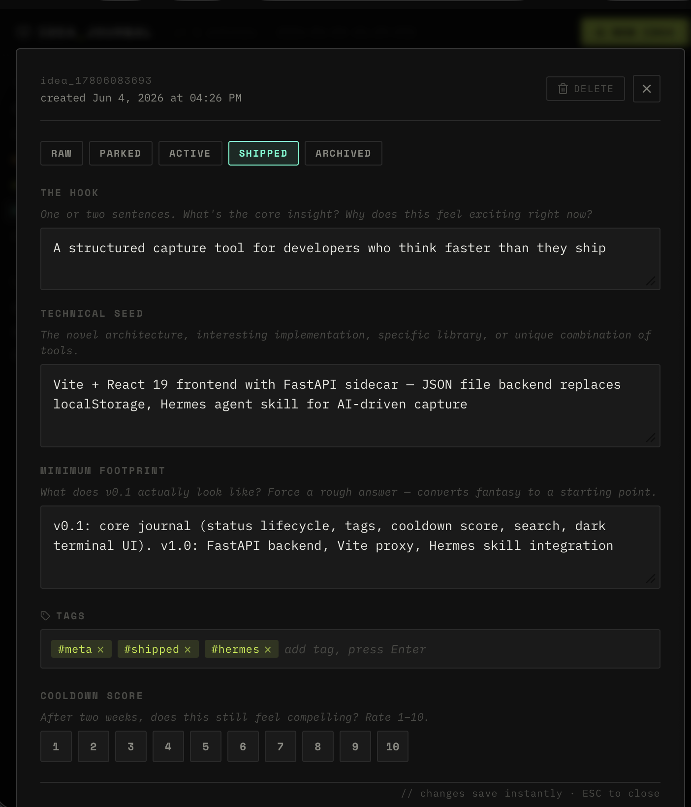

# IDEA JOURNAL

> A structured capture tool for developers who think faster than they ship.


*Dashboard — one idea logged, shipped, with sidebar filtering and search*


*Detail modal — three-field capture (Hook / Technical Seed / Minimum Footprint), status lifecycle, tags, cooldown score*

Built for the moment creative brilliance strikes mid-dev-cycle — log it, park it, come back to it. Every idea gets three fields that convert raw inspiration into something actionable, a status lifecycle to track where it lives in your pipeline, a cooldown score to separate real ideas from temporary excitement, and a FastAPI backend for AI-driven capture and agent workflows.

---

## Why This Exists

The biggest threat to shipping isn't distraction — it's **project multiplication**. A new idea hits at 2am and suddenly you're laying the groundwork for something new instead of pushing the current project to v1.0.

Idea Journal is the parking lot. Capture the idea with enough structure to recover it later, set it to `PARKED`, and get back to work.

---

## Structure

Every idea is captured across three intentional fields:

| Field | Purpose |
|---|---|
| **THE HOOK** | One or two sentences. The core insight. Why it feels exciting *right now*. |
| **TECHNICAL SEED** | The novel architecture, specific library, or unique implementation detail. |
| **MINIMUM FOOTPRINT** | What does v0.1 actually look like? Converts fantasy into a starting point. |

---

## Status Lifecycle

```
RAW → PARKED → ACTIVE → SHIPPED → ARCHIVED
```

- **RAW** — just captured, unreviewed
- **PARKED** — logged and cooling off
- **ACTIVE** — promoted to current dev cycle
- **SHIPPED** — done
- **ARCHIVED** — dead end, kept for reference

---

## Features

- Three-field structured capture (Hook / Technical Seed / Minimum Footprint)
- Status lifecycle with sidebar filtering
- Free-form tags with full-text search
- Cooldown score (1–10) for two-week reviews
- Live autosave on every keystroke
- Dark terminal aesthetic — IBM Plex Mono + Space Mono
- **FastAPI backend with JSON file persistence** (replaces browser-only localStorage)
- **Hermes agent skill** — log ideas directly from chat via the API
- **Agent command panel** — switch between `/claude` and `/codex` commands inside the idea modal
- **Codex workflow contract** — active idea polling, scaffold briefs, and implementation plans

---

## Stack

- Vite + React 19
- CSS Modules
- FastAPI + Python (backend sidecar)
- JSON file persistence
- lucide-react icons
- Hermes agent skill for AI-driven capture
- Anthropic SDK for Claude-powered expansion and scoring
- Claude Code and Codex command contracts

---

## Getting Started

### One-command dev

```bash
git clone git@github.com:hellasleeper108/Idea-Journal.git
cd Idea-Journal
npm install
npm run dev:all
```

This starts the backend on `http://127.0.0.1:8000` and the frontend on
`http://127.0.0.1:5173`. Press Ctrl-C once to stop both servers.

### Manual backend setup

Run this once if `backend/.venv` does not exist yet:

```bash
cd backend
python3 -m venv .venv
source .venv/bin/activate
pip install -r requirements.txt
export ANTHROPIC_API_KEY=...   # optional; fallback drafts work without a key
cd ..
python -m uvicorn backend.main:app --port 8000   # API on :8000
```

Then open `http://localhost:5173`. The frontend proxies `/api/*` to the backend.

---

## API Endpoints

| Method | Path | Description |
|--------|------|-------------|
| `GET` | `/health` | Health check |
| `GET` | `/ideas` | List ideas (`?status=`, `?tag=`, `?search=`) |
| `GET` | `/ideas/active` | List active ideas for code agents |
| `GET` | `/ideas/{id}` | Get single idea |
| `POST` | `/ideas` | Create new idea |
| `PATCH` | `/ideas/{id}` | Partial update |
| `DELETE` | `/ideas/{id}` | Delete idea |
| `GET` | `/tags` | All unique tags |
| `POST` | `/claude/expand` | Expand and patch an idea |
| `POST` | `/claude/scaffold` | Return a scaffold brief |
| `POST` | `/claude/score` | Score cooled-down parked ideas |
| `POST` | `/claude/command` | Stream inline `/claude` responses |
| `POST` | `/codex/expand` | Expand and patch an idea for Codex handoff |
| `POST` | `/codex/scaffold` | Return a Codex scaffold brief |
| `POST` | `/codex/plan` | Return a Codex implementation plan |
| `POST` | `/codex/command` | Stream inline `/codex` responses |

### Example: log an idea via curl

```bash
curl -s -X POST http://localhost:8000/ideas \
  -H "Content-Type: application/json" \
  -d '{
    "hook": "Your core insight here",
    "seed": "The technical approach",
    "footprint": "What v0.1 looks like",
    "tags": ["tag1", "tag2"],
    "status": "raw"
  }'
```

---

## Roadmap

| Version | Status | Description |
|---------|--------|-------------|
| v0.1 | ✅ shipped | Core journal — capture, status, tags, cooldown score, persistence |
| v1.0 | ✅ shipped | Hermes agent integration — FastAPI sidecar, JSON file backend, full CRUD API |
| v1.1 | ✅ shipped | Claude and Codex sidecar commands, active-idea workflow, agent scaffold and plan endpoints |
| v2.0 | 🔲 planned | Multi-user auth, PostgreSQL backend, real-time sync |

See [docs/v1.1-ai-integration.md](docs/v1.1-ai-integration.md) for the Claude
Code and Codex integration plan.

---

## Part Of

**Silicon Warlock LLC** — [github.com/hellasleeper108](https://github.com/hellasleeper108)
